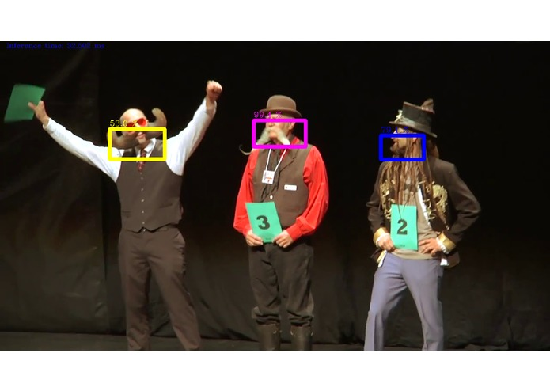

# bclassified
**classifying beards of the champions**

🏆 tied for 2nd place of the Intel Challenge at the Hackatum Hackathon 2018 (https://devpost.com/software/bclassified)

## Usage
First install openVINO (This works on Ubuntu 16 (!) or Windows 10 only.)

(Optional)

1. chmod -R user:name /opt/intel/

2. Create symlink to /opt/intel/computer_vision_sdk/deployment_tools/inference_engine/samples/

`~/$ ln -s /opt/intel/computer_vision_sdk/deployment_tools/inference_engine/samples/ samples`

3. Create symlink to /opt/intel/computer_vision_sdk/deployment_tools

`~/$ ln -s /opt/intel/computer_vision_sdk/deployment_tools dep`

With symlinks we can now start the python script from samples folder. Notice worldbeard.mp4 as an example video file which has to be located in samples, too.

`cd samples` 

`python3 first_try.py -m ../../intel_models/face-detection-retail-0004/FP32/face-detection-retail-0004.xml -i worldbeard.mp4 -l ~/dep/inference_engine/lib/ubuntu_16.04/intel64/libcpu_extension_avx2.so`

